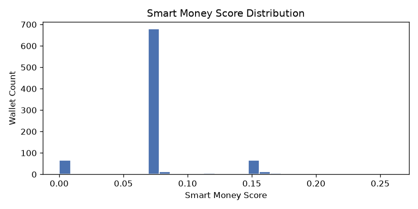
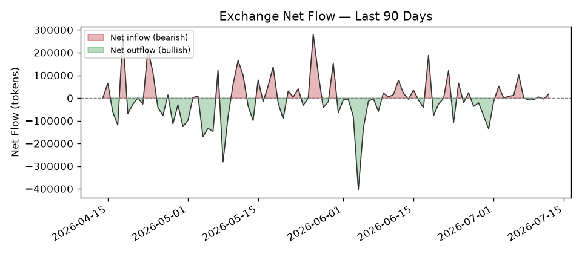

# chainrnd Summary Report
**Token:** `0xfeac2eae96899709a43e252b6b92971d32f9c0f9` on **ethereum**  
**Generated:** 2026-07-12 09:42 UTC

## Quick Stats

- Total transfers analyzed: **310,103**
- Unique wallets seen: **42,039**
- Date range: **2024-06-21** to **2026-07-12**
- Whale/smart-money wallets ranked: **866**
- Days of exchange-flow data: **750**
- Large-flow alerts: **264**

## Top Whale / Smart-Money Wallets

| # | Wallet | Score | Realized PnL (USD) | Net Position | Coordinated? | Fresh Big Buy? |
|---|---|---|---|---|---|---|
| 1 | `0xfb19...f8ee` | 0.2595 | $1,143 | 239,000 | Yes | Yes |
| 2 | `0xc5d3...31bd` | 0.2401 | $-803 | 326,906 | Yes | Yes |
| 3 | `0x6d6c...7fec` | 0.2279 | $0 | 5,037,369 | Yes | Yes |
| 4 | `0x10ad...e5c3` | 0.2071 | $0 | 105,434 | Yes | Yes |
| 5 | `0xaa10...d5b2` | 0.1956 | $0 | 1,103,995 | Yes | No |
| 6 | `0xc2aa...ac9e` | 0.1947 | $-10,753 | 144,234 | Yes | Yes |
| 7 | `0x3a75...8f4f` | 0.1788 | $0 | 282,000 | No | Yes |
| 8 | `0x3607...af73` | 0.1771 | $0 | 175,000 | No | Yes |
| 9 | `0xcdb4...86a3` | 0.1746 | $0 | 600,000 | Yes | Yes |
| 10 | `0x4a99...ef21` | 0.1734 | $0 | 122,407 | Yes | Yes |
| 11 | `0xfed3...6c63` | 0.1692 | $0 | 250,000 | Yes | Yes |
| 12 | `0x040e...f617` | 0.1674 | $0 | 150,000 | No | Yes |
| 13 | `0xaf9d...a4a8` | 0.1656 | $0 | 200,549 | Yes | Yes |
| 14 | `0x8a5f...de9a` | 0.1655 | $0 | 1,000,000 | Yes | Yes |
| 15 | `0x0761...23c4` | 0.1654 | $0 | 120,001 | Yes | Yes |

## Exchange Flow Trend

**Current signal (most recent day):** bearish_pressure (net inflow to exchanges)

## Recent Large-Flow Alerts

| Date | Direction | Amount (tokens) |
|---|---|---|
| 2026-06-29 16:10:59+00:00 | deposit_to_exchange | 161,819 |
| 2026-06-29 15:50:35+00:00 | withdrawal_from_exchange | 159,987 |
| 2026-06-18 20:38:47+00:00 | deposit_to_exchange | 111,588 |
| 2026-06-10 14:58:47+00:00 | withdrawal_from_exchange | 100,001 |
| 2026-06-05 07:32:59+00:00 | withdrawal_from_exchange | 102,700 |
| 2026-06-04 08:21:59+00:00 | withdrawal_from_exchange | 378,971 |
| 2026-05-26 08:50:11+00:00 | deposit_to_exchange | 100,000 |
| 2026-05-26 08:45:59+00:00 | deposit_to_exchange | 100,000 |
| 2026-05-26 08:15:11+00:00 | deposit_to_exchange | 100,000 |
| 2026-05-11 06:39:23+00:00 | deposit_to_exchange | 178,742 |
